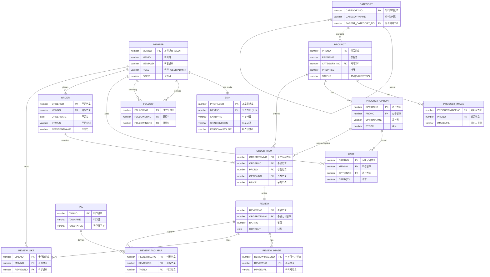

<div align="center">

# Coco Shopping Mall

**사용자 후기 중심 뷰티 커머스**

[](https://www.oracle.com/java/)
[](https://spring.io/projects/spring-boot)
[](https://reactjs.org/)
[](https://www.oracle.com/database/)
[](LICENSE)

</div>

---

## 1. 목표와 기능

### 1.1 프로젝트 소개 및 목표
**"피부 타입 기반 상품 추천과 사용자 후기를 통한 스마트한 쇼핑 경험"**

**Coco**는 사용자 후기와 피부 프로필을 기반으로 한 뷰티 쇼핑몰 플랫폼입니다. 단순한 상품 판매를 넘어서, 사용자들이 작성한 리뷰와 피부 타입 정보를 활용하여 더 나은 구매 결정을 할 수 있도록 돕는 것이 목표입니다.

- **피부 맞춤형 큐레이션**: 사용자의 피부 프로필(지성, 건성, 웜톤/쿨톤 등)을 분석하여 최적의 뷰티 아이템을 제안합니다.
- **신뢰할 수 있는 리뷰 생태계**: 단순 상품 평점이 아닌, 나와 유사한 피부 타입을 가진 유저(Comate)의 리뷰를 우선적으로 보여주어 정보의 정확도를 높입니다.
- **커뮤니티형 커머스**: 취향이 맞는 유저를 팔로우하고 소통하며 정보를 공유하는 Social-Commerce를 지향합니다.
- **실전형 풀스택 아키텍처**: Spring Boot와 React를 활용한 완벽한 분리형 구조와 JWT 기반의 보안 시스템을 구축하여 실무 수준의 개발 역량을 입증합니다.

### 1.2 주요 기능
- **회원 및 보안 시스템**
  - 일반 회원가입 및 소셜 로그인 (카카오, 네이버, 구글)
  - JWT Access/Refresh Token 기반의 이중 보안 인증
  - 이메일 인증을 통한 아이디/비밀번호 찾기
- **Comate (핵심 기능)**
  - 피부 진단 테스트 및 프로필(피부타입, 고민, 퍼스널컬러) 등록
  - 유사도 알고리즘(매칭률) 기반 친구/상품/리뷰 추천
  - 유저 팔로우/언팔로우 및 활동 내역(작성 리뷰, 좋아요) 모아보기
- **상품 및 쇼핑 시스템**
  - 카테고리별 상품 조회, 검색, 필터링 (피부 타입별 필터 제공)
  - 장바구니 담기, 수량 변경, 선택 삭제
  - PortOne API 연동을 통한 실시간 결제 및 주문 내역 관리
- **리뷰 커뮤니티**
  - 텍스트, 이미지, 태그(장/단점)를 포함한 리뷰 작성
  - 리뷰 좋아요 및 도움이 된 리뷰 정렬
  - '나와 비슷한 피부 타입' 유저의 리뷰만 필터링하여 보기
- **관리자(Admin) 대시보드**
  - 대시보드 통계 (판매량, 가입자 수 등)
  - 상품 등록/수정/삭제 및 카테고리 관리
  - 전체 회원 조회 및 적립금(포인트) 관리
  - 주문 현황 조회 및 취소 처리

- ### 1.3 팀 구성
- 이 프로젝트는 **K-Digital Training Java 풀스택 개발자 아카데미 6회차** 최종 프로젝트로, 6명의 팀원이 협업하여 개발했습니다.
<table>
    <tr>
        <th>팀장</th>
        <th>Full Stack</th>
        <th>Full Stack</th>
        <th>Full Stack</th>
        <th>Full Stack</th>
        <th>Full Stack</th>
    </tr>
    <tr>
        <td></td>
        <td></td>
        <td></td>
        <td></td>
        <td></td>
        <td></td>
    </tr>
    <tr>
        <td>신태엽 (리뷰 / 배포)</td>
        <td>이규리 (Co-mate)</td>
        <td>이준범 (장바구니 / 마이페이지)</td>
        <td>임응규 (주문)</td>
        <td>최승훈 (상품 / 관리자)</td>
        <td>추현민 (회원가입 / 인증)</td>
    </tr>
</table>

## 2. 개발 환경 및 기술 스택

### 2.1 Backend

| 기술 | 버전 | 용도 |
|:---:|:---:|---|
| **Java** | 21 | 메인 프로그래밍 언어 |
| **Spring Boot** | 3.5.7 | 웹 애플리케이션 프레임워크 |
| **Spring Security** | - | 인증 및 권한 관리 (Security Filter Chain) |
| **Spring Data JPA** | - | ORM 기반 데이터베이스 접근 |
| **JWT (jjwt)** | 0.12.3 | 토큰 기반 Stateless 인증 구현 |
| **Oracle Database** | 19c | 관계형 데이터베이스 (AWS RDS / Local) |
| **Gradle** | 8.x | 빌드 및 의존성 관리 도구 |

### 2.2 Frontend

| 기술 | 버전 | 용도 |
|:---:|:---:|---|
| **React** | 19.2.0 | 사용자 인터페이스 라이브러리 |
| **React Router** | 7.9.5 | 클라이언트 사이드 라우팅 (SPA 구현) |
| **Styled Components** | 6.1.19 | CSS-in-JS 스타일링 시스템 |
| **Axios** | 1.13.2 | 비동기 데이터 통신 (HTTP Client) |
| **React Slick** | 0.31.0 | 메인 배너 및 추천 상품 캐러셀 UI |

### 2.3 Infra & Tools

| 기술 | 용도 |
|:---:|---|
| **AWS EC2** | 애플리케이션 배포 서버 |
| **PortOne** | 결제 시스템 연동 API |
| **Naver/Kakao/Google** | OAuth 2.0 소셜 로그인 API |
| **Git / GitHub** | 형상 관리 및 협업 도구 |
| **Figma** | UI/UX 와이어프레임 및 디자인 |
| **Notion** | 프로젝트 일정 및 문서 관리 |

### 2.4 배포 URL
- **Frontend**: http://13.231.28.89
- **Backend API**: http://13.231.28.89:18080
- **테스트 계정**
  ```text
  ID: test
  PW: test11!!
  ```
### 2.5 URL 구조

#### Frontend (React Router 구조)

| 대분류 | URL 경로 | 컴포넌트 | 설명 | 권한 |
|:---:|---|---|---|:---:|
| **메인** | `/` | `Home` | 메인 페이지 (베스트/신상품/Comate) | 🌐 |
| **인증** | `/login` | `Login` | 일반/소셜 로그인 (Kakao, Naver, Google) | 🌐 |
| | `/signup/terms` | `SignupTerms` | 회원가입 (약관동의) | 🌐 |
| | `/signup/info` | `SignupInfo` | 회원가입 (정보입력/이메일인증) | 🌐 |
| | `/find-account` | `FindAccount` | 아이디/비밀번호 찾기 | 🌐 |
| **마이페이지** | `/mypage` | `MyPage` | 마이페이지 메인 | ✅ |
| | `/order-history` | `OrderHistory` | 주문/배송 조회 | ✅ |
| | `/profile-edit` | `ProfileEdit` | 회원정보/비밀번호 수정 | ✅ |
| | `/my-comate` | `MyCoMate` | 나의 피부 프로필 관리 | ✅ |
| **Comate** | `/comate/me` | `Comate` | 나의 코메이트 (추천/팔로우) | ✅ |
| | `/comate/user/:memNo` | `Comate` | 타 유저 프로필 및 리뷰 조회 | 🌐 |
| **쇼핑** | `/product` | `ProductListPage` | 상품 목록 (필터/검색) | 🌐 |
| | `/products/:id` | `ProductDetailPage`| 상품 상세 (리뷰/대시보드) | 🌐 |
| | `/cart` | `Cart` | 장바구니 | ✅ |
| **주문/결제** | `/order` | `OrderPage` | 주문서 작성 | ✅ |
| | `/payment` | `PaymentPage` | 결제 진행 (PortOne) | ✅ |
| | `/order-success` | `OrderSuccessPage`| 주문 완료 | ✅ |
| **관리자** | `/admin/products` | `AdminProductList` | 상품 관리 (조회/삭제) | 👑 |
| | `/admin/product/new` | `AdminProductNew` | 상품 등록 (이미지/옵션) | 👑 |
| | `/admin/product/edit/:id`| `AdminProductEdit` | 상품 수정 | 👑 |
| | `/admin/categories` | `AdminCategoryList`| **카테고리 관리** | 👑 |
| | `/admin/members` | `AdminMemberList` | 회원 관리 (포인트 수정) | 👑 |
| | `/admin/orders` | `AdminOrderList` | 전체 주문 관리 | 👑 |

#### Backend API (주요 Controller)

| Controller | Method | URL Endpoint | 기능 설명 | 권한 |
|---|:---:|---|---|:---:|
| **Member** | POST | `/api/member/signup` | 회원가입 | 🌐 |
| | POST | `/api/member/login` | 로그인 (JWT 발급) | 🌐 |
| | POST | `/api/member/oauth/{provider}` | 소셜 로그인 (Kakao/Naver/Google) | 🌐 |
| | GET | `/api/member/admin/list` | 전체 회원 목록 조회 (검색/페이징) | 👑 |
| | PUT | `/api/member/admin/{no}/point` | **회원 적립금(포인트) 수정** | 👑 |
| **Product** | GET | `/api/products` | 상품 목록 조회 (피부타입 필터링) | 🌐 |
| | GET | `/api/products/{no}` | 상품 상세 조회 | 🌐 |
| | GET | `/api/products/{no}/similar-skin` | **유사 피부 타입 유저 통계 조회** | ✅ |
| **Admin Prd**| POST | `/api/admin/products` | 상품 등록 (Multipart Image) | 👑 |
| | GET | `/api/admin/stats` | **관리자 대시보드 통계** | 👑 |
| **Order** | POST | `/api/orders` | 주문 생성 | ✅ |
| | GET | `/api/orders/my` | 내 주문 내역 조회 | ✅ |
| | POST | `/api/orders/{no}/cancel` | 주문 취소 | ✅ |
| **Cart** | GET | `/api/coco/members/cart/items` | 장바구니 목록 조회 | ✅ |
| | POST | `/api/coco/members/cart/items` | 장바구니 상품 추가 | ✅ |
| **Review** | POST | `/api/reviews` | 리뷰 작성 (이미지 업로드) | ✅ |
| | GET | `/api/products/{no}/reviews` | 상품별 리뷰 목록 | 🌐 |

## 3. 시작하기 (Getting Started)

이 프로젝트는 **Java 21**과 **Node.js** 환경에서 실행됩니다. 로컬 환경에서 실행하기 위해 아래 절차를 따라주세요.

### 3.1 필수 요구사항 (Prerequisites)
- **JDK 21** 이상
- **Node.js 18.x** 이상 (React 19 구동을 위해 권장)
- **Oracle Database 11g/19c** (로컬 또는 원격 접속)
- **PortOne (Iamport) API Key** (결제 테스트용)

### 3.2 설치 및 실행 (Installation)

#### 1) 저장소 클론 (Clone)
```bash
git clone [https://github.com/your-username/Shoppingmall-coco.git](https://github.com/your-username/Shoppingmall-coco.git)
cd Shoppingmall-coco
```

#### 2) Backend 설정 (Spring Boot)

* **설정 파일 수정**: `src/main/resources/application.properties` 파일을 생성하거나 수정하여 DB 및 API 키를 설정해야 합니다.

```properties
# Database Configuration
spring.datasource.url=jdbc:oracle:thin:@localhost:1521:xe
spring.datasource.username=YOUR_DB_USERNAME
spring.datasource.password=YOUR_DB_PASSWORD

# PortOne (Payment) API
iamport.api-key=YOUR_PORTONE_API_KEY
iamport.api-secret=YOUR_PORTONE_API_SECRET

# OAuth (Social Login)
kakao.client-id=YOUR_KAKAO_KEY
naver.client-id=YOUR_NAVER_KEY
google.client-id=YOUR_GOOGLE_KEY

# File Upload Path (Local)
file.upload-dir=C:/coco/uploads/
```

* **실행**:
```bash
cd shoppingmall-back
./gradlew bootRun
```

#### 3) Frontend 설정 (React)

* **의존성 설치 및 실행**:
```bash
cd shoppingmall-front
npm install
npm start
```

* 실행 후 브라우저에서 `http://localhost:3000`으로 접속합니다.

#### 4) 데이터베이스 설정 (Oracle)

프로젝트에 포함된 SQL 스크립트를 실행하여 테이블을 생성해야 합니다. (SQL Plus 또는 SQL Developer 사용)

```sql
-- 1. 전체 테이블 생성 (예시 경로)
@shoppingmall-back/src/main/resources/create_all_tables.sql

-- 2. Comate 관련 테이블 생성 (필요 시)
@shoppingmall-back/src/main/resources/create_comate_tables.sql
```


## 4. 요구사항 명세와 기능 명세

### 4.1 기능 흐름도 (Sequence Diagram)
**Comate 추천 시스템 로직 (RecommendationService)**


  
## 5. 프로젝트 구조

```text
Shoppingmall-coco
 ┣ 📂shoppingmall-back (Spring Boot)
 ┃ ┣ 📂src/main/java/com/shoppingmallcoco/project
 ┃ ┃ ┣ 📂config        # Security, WebMvc, Iamport 설정
 ┃ ┃ ┣ 📂controller    # Admin, Comate, Member 등 API 컨트롤러
 ┃ ┃ ┣ 📂dto           # 데이터 전송 객체
 ┃ ┃ ┣ 📂entity        # JPA 엔티티 (Member, Product, Review...)
 ┃ ┃ ┣ 📂repository    # Data Access Layer
 ┃ ┃ ┣ 📂service       # 비즈니스 로직 (핵심: RecommendationService)
 ┃ ┃ ┗ 📂util          # JWT 유틸리티
 ┃ ┗ 📂resources
 ┃   ┗ 📜application.properties # DB 및 API 설정
 ┗ 📂shoppingmall-front (React)
   ┣ 📂public
   ┗ 📂src
     ┣ 📂components    # Admin, Product, Layout 공통 컴포넌트
     ┣ 📂features      # 커스텀 훅 및 로직 (상품 리뷰, 필터 등)
     ┣ 📂pages         # 라우팅 페이지 (Admin, MyPage, Product...)
     ┣ 📂styles        # Styled-components 테마
     ┣ 📂utils         # API 호출 유틸리티
     ┣ 📜App.js        # 라우팅 정의
     ┗ 📜index.js      # Entry Point
```

## 6. 역할 분담

| 이름 | 포지션 | 담당 업무 |
|:---:|:---:|---|
| **신태엽** | PM / Full Stack | 프로젝트 총괄, 일정 관리, 코드 머지 및 리뷰, 배포 (FE/BE) |
| **이규리** | Full Stack | **Co-mate** (피부 타입 기반 추천/커뮤니티) 구현 |
| **이준범** | Full Stack | 장바구니, 마이페이지 (주문 내역, 정보 수정) 구현 |
| **임응규** | Full Stack | 주문 및 결제 시스템 (PortOne API 연동) 구현 |
| **최승훈** | Full Stack | 상품 리스트/상세, 관리자(Admin) 페이지 구현 |
| **추현민** | Full Stack | 회원가입/로그인 (OAuth), JWT 보안 시스템 구축 |

## 7. 와이어프레임 / UI

| 메인 화면 | 마이페이지 (Comate) |
|:---:|:---:|
|  |  |
| **상품 상세 / 리뷰** | **관리자 대시보드** |
|  |  |

## 8. 데이터베이스 모델링 (ERD)



## 9. Architecture


## 10. 메인 기능 및 핵심 로직

### 10.1 Comate 추천 알고리즘 (`RecommendationService.java`)
이 프로젝트의 핵심 차별점은 **유사 피부 타입 기반 추천**입니다. 
단순히 판매량 순이 아닌, 사용자와 성향이 비슷한 유저의 데이터를 분석합니다.

1.  **상품 추천 우선순위**
    * 1순위: 내가 팔로우한 Comate들이 구매한 상품
    * 2순위: 나와 피부 타입 매칭률(Match Rate)이 70% 이상인 유저들이 구매한 상품
    * 3순위: (데이터 부족 시) 최신 등록 상품 (Fallback)
2.  **유사도 계산 (`MatchingService`)**
    * 피부 타입(지성/건성 등), 피부 고민(아토피, 여드름 등), 퍼스널 컬러 정보를 수치화하여 유저 간 일치도를 백분율로 환산합니다.

### 10.2 JWT 기반 보안 인증
- **Access/Refresh Token**: `JwtAuthenticationFilter`를 통해 모든 API 요청을 필터링하며, `Forbidden`, `Unauthorized` 에러를 클라이언트(`App.js`)에서 적절히 처리하여 로그인 페이지로 유도합니다.

### 10.3 관리자(Admin) 기능
- `AdminProtectedRoute` 컴포넌트를 통해 관리자 권한이 없는 유저의 접근을 원천 차단합니다.
- 상품 등록, 수정, 삭제 및 회원 관리 기능을 React 관리자 전용 레이아웃(`AdminLayout`)에서 제공합니다.

## 11. 트러블 슈팅 (Trouble Shooting)

### 11.1 이미지 경로 문제
- **문제**: 로컬 환경과 배포 환경(Linux)의 파일 경로 구분자 차이로 인해 이미지가 엑박으로 뜨는 현상 발생.
- **해결**: `application.properties`에서 `file.upload-dir`을 환경별로 분리하고, `WebMvcConfig`에서 `addResourceHandlers`를 통해 외부 경로를 정적 리소스로 매핑하여 해결했습니다.

### 11.2 순환 참조 문제 (JPA)
- **문제**: 양방향 연관관계가 걸린 Entity를 직접 JSON으로 반환 시 무한 루프 발생 (`StackOverflowError`).
- **해결**: Entity를 직접 반환하지 않고, `ProductDetailResponseDTO`, `RecommendResponseDTO` 등 목적에 맞는 **DTO**를 생성하여 필요한 데이터만 담아 반환하도록 리팩토링했습니다.

## 12. 개발하며 느낀점

- **신태엽 (PM)**: 프로젝트 일정 관리와 배포 파이프라인 구축을 통해 DevOps의 중요성을 깨달았습니다. 팀원들의 코드를 리뷰하며 코드 품질을 높이는 경험이 유익했습니다.
- **이규리 (Co-mate)**: 피부 타입 매칭 알고리즘을 구현하며 복잡한 비즈니스 로직을 효율적인 쿼리로 변환하는 과정에서 많이 성장했습니다.
- **이준범 (장바구니/마이페이지)**: React 상태 관리를 통해 사용자 경험을 개선하고, 개인정보 수정 시 보안 이슈를 꼼꼼히 체크하는 습관을 길렀습니다.
- **임응규 (주문)**: 외부 결제 API(PortOne)를 연동하며 트랜잭션 처리와 예외 상황 핸들링에 대해 깊이 있게 학습했습니다.
- **최승훈 (상품/관리자)**: 상품 등록 시 다중 이미지 처리와 옵션 관리 로직을 구현하며 데이터 구조 설계의 중요성을 배웠습니다.
- **추현민 (회원/보안)**: JWT와 OAuth 2.0을 결합한 인증 시스템을 구축하며 웹 보안의 핵심 원리를 이해하게 되었습니다.

---

## 13. 라이센스

이 프로젝트는 MIT 라이센스를 따릅니다. 자세한 내용은 [LICENSE](LICENSE) 파일을 참고하세요.

---

## 14. 감사의 말

- [K-Digital Training](https://www.k-digital.or.kr/) - 교육 기회 제공
- [Spring Boot](https://spring.io/projects/spring-boot) - 강력한 백엔드 프레임워크
- [React](https://reactjs.org/) - 유연한 프론트엔드 라이브러리

---

## 15. 문의

프로젝트에 대한 문의사항이나 제안사항이 있으시면 이슈를 등록해주세요.

---
<div align="center">
  Generated by Coco Team 
</div>

[Back to Top](#coco-shopping-mall)


